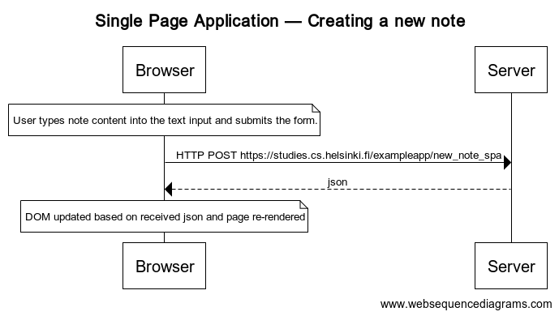

# Round 0: Fundamentals of Web Applications
This round of exercises required analysis of
the web traffic (HTTP requests and responses) between the client web-browser and the server's note application. There were two implementations of the application: the [traditional](https://studies.cs.helsinki.fi/exampleapp/) and the [single page application](https://studies.cs.helsinki.fi/exampleapp/spa).

In Exercise 0.4, we're asked to illustrate the traffic generated by the user adding a new note on the traditional 
application via a web sequence diagram.
In Exercise 0.5, we're asked to illustrate the traffic generated by the loading of a single page application via a web sequence diagram.

Finally, in Exercise 0.6, we're asked to illustrate the traffic generated by the user adding a new note on the single page application via a web sequence diagram.

## 0.4. New Note

The diagram below is the web sequence diagram of the 
traditional web application when adding a new note:

## 0.5. Single page app

The diagram below is the websequence diagram of the 
single page application on opening:

# 0.5. Single page app—New note

The diagram below is the websequence diagram of the 
single page application when adding a new note:

